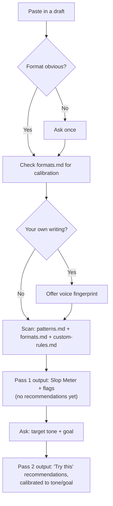

# Unslop
### AI Slop Detector

A prose auditor for marketers and knowledge workers. Paste in a draft — an email, a LinkedIn post, a deck, a PRFAQ — and it flags the tics that make writing read as machine-generated, explains why each one is a tell, and coaches you to fix it yourself instead of quietly rewriting it for you.

## Why this exists

Most AI-detection tools just slap a percentage on your text and call it a day. That's not useful if you're trying to actually get better at spotting the tells yourself — and it's especially useless if the "detector" then hands you a generic rewrite, which is just slop with the rough edges filed off.

This skill works differently:

- **It teaches, it doesn't fix.** The default output is a diagnosis — what's wrong and why — not a rewritten paragraph. You do the editing. (There's a "Try this" line per flag, not a "replace with" line.)
- **It's format-aware.** A Slack message and a formal proposal aren't held to the same bar. Bullets are correct on a slide and a violation in a narrative doc — the skill knows the difference instead of flagging everything the same way.
- **It can learn your voice.** Optionally, it'll build a lightweight fingerprint from your own writing and flag spots that don't sound like *you* specifically — on top of, not instead of, the generic AI-tell check.

## What it checks for

Four categories of tells, covered in [`references/patterns.md`](references/patterns.md) — several drawing on and using terminology from Wikipedia's community-maintained essay [Signs of AI writing](https://en.wikipedia.org/wiki/Wikipedia:Signs_of_AI_writing), including its explicit caution that none of these patterns, alone or combined, proves a piece of text was AI-written:

1. **Vocabulary tics** — "leverage," "unlock," "seamless," "robust," and the rest of the corporate-verb family that stands in for a concrete action.
2. **Sentence-shape tics** — "It's not just X, it's Y," rule-of-three-itis, hedge-then-overclaim, false balance.
3. **Structural tics** — forced bullet-ification, a header on every paragraph, unnecessary "in conclusion" wrap-ups.
4. **Empty-calorie content** — sentences that restate the one before them, filler transitions, generic scene-setting, fake specificity.

On top of the base pattern check:

- **[`references/formats.md`](references/formats.md)** calibrates all of the above for 11 different formats (email, Slack, LinkedIn, exec summaries, PRDs/PRFAQs, slide bullets vs. speaker notes, blog posts, press releases, performance reviews, proposals, meeting notes) — so it doesn't flag a Slack fragment for not being a full sentence, or miss that six bullets in a narrative doc are the problem.
- **[`references/voice-fingerprint.md`](references/voice-fingerprint.md)** is an optional layer that only activates when you're checking your own writing — it flags drift from your established voice, separately labeled from the generic AI tells.
- **[`references/custom-rules.md`](references/custom-rules.md)** is a blank template you fill in with your own tics or your company's brand/compliance guidelines — e.g. "no superlatives unless the claim is verified." These get checked on every scan and labeled separately from the generic AI-tell flags, since they're your rules, not universal ones. See "Adding your own rules" below.

Every check ends with a **Slop Meter** (a 5-dot rating per section, not one score for the whole document — slop clusters, so a single number hides where the actual problem is) and, if you want it, a short prompt asking your target **tone** (academic, professional, conversational, authoritative, persuasive) and **goal** (humanize it, condense it, sound smarter, simplify, persuade) so the recommendations are aimed at what you're actually trying to do.

## How it flows



## Repo structure

```
unslop/
├── SKILL.md                      ← entry point: the workflow, the two-pass flow, the Slop Meter format
├── README.md                     ← this file
└── references/
    ├── patterns.md                ← the core tell library (vocabulary, sentence-shape, structural, empty-calorie)
    ├── formats.md                 ← per-format calibration (email, Slack, LinkedIn, PRFAQ, slides, etc.)
    ├── voice-fingerprint.md       ← optional layer: flags drift from YOUR established voice
    └── custom-rules.md            ← blank template: your own tics or your company's brand/compliance rules
```

`SKILL.md` is what an AI tool reads first — it's the instructions. The four files under `references/` are loaded as needed rather than all at once, which keeps things fast. You never run or execute anything here; it's all plain markdown.

## Take it with a grain of salt

Quick word before you install this and start pasting in everything you've ever written: every flag this thing gives you is a "hey, look at this," not a "you did this wrong." It's a watch list, not a ban list — nothing in here, not one word, not one sentence shape, is actually forbidden.

Some of what gets flagged will be exactly the thing you want to keep. Maybe it's genuinely your voice. Maybe the format calls for it. Maybe you just like it and that's a good enough reason. This isn't a compliance check you have to pass — it's a second pair of eyes, and second pairs of eyes are allowed to be wrong, or right about something you don't feel like fixing today.

So: read the flags, keep what's actually yours, and give your own writing — and yourself — a little grace.

## How to use it

A "skill" here means a folder with a `SKILL.md` file inside — plain instructions the AI reads and follows. No code, nothing to compile. You're just telling the assistant "here's how to do this task," and it picks it up automatically when relevant.

This repo is one skill: `SKILL.md` plus the four files it points to under `references/`. Below is how to install it in four different tools. Pick the one(s) you actually use — you don't need all four.

### Claude (claude.ai)

If you're using Claude through a **Project**:
1. Open or create a Project in Claude.
2. Go to **Project knowledge** and upload `SKILL.md` and the four files in `references/`.
3. Claude reads them as context automatically — just ask "check this for AI slop" in that project.

If you're using **Claude Code** (the terminal/IDE tool):
1. Copy this whole folder into `~/.claude/skills/unslop/` (applies everywhere) or `.claude/skills/unslop/` inside a specific project (applies just there).
2. That's it — Claude Code auto-discovers skills in that location and activates it when you ask to check something for AI slop.

### Codex / ChatGPT

1. Copy this whole folder into `~/.agents/skills/unslop/` — that's the shared skills location both ChatGPT (desktop app) and Codex CLI read from.
2. If you're working inside a specific code repo and only want it there, put it in `.agents/skills/unslop/` at the root of that repo instead.
3. Codex/ChatGPT picks it up automatically; if you don't see it after adding it, restart the app or CLI session.

### Kiro

1. Copy this whole folder into `~/.kiro/skills/unslop/` (available in every project) or `.kiro/skills/unslop/` inside one project folder.
2. Kiro supports the same open Agent Skills format this repo already uses, so no conversion is needed — it discovers and activates the skill automatically when a task matches.

### Amazon Quick

Quick has a built-in upload flow, so you don't need to touch folders at all:
1. In the Quick desktop app, choose **Agents & skills** in the left navigation, then the **Skills** tab.
2. Choose **+ Create**, then **Import from file**.
3. Select `SKILL.md` from wherever you downloaded this repo.
4. Review it and save. It'll show up under **My Skills**, and you can attach the `references/` files from there if the import step doesn't pull them in automatically.

## Trying it out

Once it's installed anywhere above, just paste text and ask naturally — you don't need to name the skill:

- "Check this for AI slop"
- "Does this LinkedIn post sound AI-generated?"
- "Help me make this email sound more human"

It'll walk you through a diagnosis first (the Slop Meter + flags), then ask what tone and goal you're going for before giving you anything to act on.

## Adding your own rules

Open `references/custom-rules.md` — it's a blank template with one worked example (an "unverified superlative" rule) showing the format. To add your own:

1. Copy the four-line block (`Rule name` / `Type` / `Rule` / `Why` / `Detection`) for each rule you want.
2. Fill it in plainly — you don't need special formatting or code, just a clear statement of what's not allowed and why.
3. Delete the example block once you've added your own, or leave it as a reference — either is fine.
4. Save the file. No re-installation needed — the skill reads it fresh on every scan.

This is entirely local to your copy of the skill. If you install this repo on a work machine and want to add your company's brand guidelines, edit `custom-rules.md` there — it won't touch anyone else's copy, and you don't need to publish your company's rules back to this public repo unless you want to.

## First time publishing to GitHub? Quick primer

If this is genuinely your first repo, here's the short version:

1. **Create the repo:** on github.com, click the **+** in the top right → **New repository**. Give it a name (`unslop` works), leave it public if you want others to use it, and click **Create repository**.
2. **Upload the files:** on the new repo's page, click **uploading an existing file** (or **Add file → Upload files**). Drag in `SKILL.md`, this `README.md`, and the `references/` folder (with its four files inside).
3. **Commit:** scroll down, add a short message like "Initial version," and click **Commit changes**.

That's the whole thing — no command line required for a simple upload like this. If you want people to install it with the `skills.sh` installer commands other repos use (`npx skills add yourname/unslop`), the file layout you already have (`SKILL.md` at the root, `references/` alongside it) is exactly what that tool expects — nothing extra to set up.
